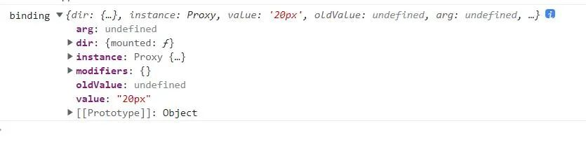
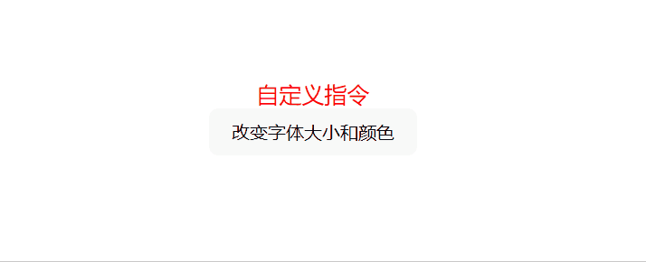

Vue 中有一堆内置的指令，如 v-for 和 v-if ，但我们也可以建立自己的自己的指令。

假设，我们有一个 FontSizeColor 组件，内容如下：

```html
// FontSizeColor.vue
<template>
  <div v-font-size-color="'20px'">
    自定义指令
  </div>
</template>
```

这里，我们声明了一个自定义指令 v-font-size-color，它主要做的一个事件就是设置当前元素的字段大小。我们在 main.js 中实现它。

```js
import { createApp } from 'vue'

const app = createApp(App)

app.directive('font-size-color', {
  mounted(el, binding) {
    console.log('binding', binding)
    el.style.fontSize = binding.value
  },
})
```


属性的含义:

+ instance：使用指令的组件实例。
+ value：传递给指令的值。例如，在 v-my-directive="1 + 1" 中，该值为 2。
+ oldValue：先前的值，仅在 beforeUpdate 和 updated 中可用。无论值是否有更改都可用。
+ arg：传递给指令的参数(如果有的话)。例如在 v-my-directive:foo 中，arg 为 "foo"。
+ modifiers：包含修饰符(如果有的话) 的对象。例如在 v-my-directive.foo.bar 中，修饰符对象为 {foo: true，bar: true}。
+ dir：一个对象，在注册指令时作为参数传递。

但如果我们不想改文字的大小而是想改字段的颜色，要怎么做呢？

我们可以使用 动态参数，例如：v-mydirective:[argument]="value"中，argument 参数可以根据组件实例数据进行更新。

所以我们在 FontSizeColor.vue 中可以这么来指定动态参数：

```html
<template>
  <div v-font-size-color:[styleField]="fontSizeAndColor">自定义指令</div>
  <button @click="changeFontSize">改变字体大小</button>
  <button @click="changeColor">改变字体颜色</button>
</template>

<script setup>
import { ref } from 'vue'

const styleField = ref('fontSize')
const fontSizeAndColor = ref('20px')

const changeFontSize = () => {
  styleField.value = 'fontSize'
  fontSizeAndColor.value = '40px'
}

const changeColor = () => {
  styleField.value = 'color'
  fontSizeAndColor.value = 'red'
}
</script>
```

这里，我们新增了两个响应式数据  styleField、fontSizeAndColor。styleField 是指令的一个动态参数，fontSizeAndColor 表示传给指令的值。

新增两个按钮，一个是改变绑定元素的字体大小，一个是改变绑定元素的颜色。当点击按钮时，我们在点击事件里面去更改了这两个变量的值，分别是 styleField.value = 'fontSize'; fontSizeAndColor.value = '40px' 、styleField.value = 'color'; fontSizeAndColor.value = 'red'。

然后回到 main.js 中，因为点击按钮改变了指令的参数和值，所以，我们需要在 updated 钩子函数中重新给元素绑定对应值，如果所示：

```js
import { createApp } from 'vue

const app = createApp(App)

app.directive('font-size-color', {
  mounted(el, binding) {
    console.log('binding', binding)
    el.style[binding.arg] = binding.value
  },
  updated(el, binding) {
    console.log('binding', binding)
    el.style[binding.arg] = binding.value
  },
})
```

运行：


观察 mounted 和 updated 钩子函数，它们的触发行为相同，并且这里我们不关心其它钩子函数，那么，我们可以通过函数传递给指令来实现：

```js
import { createApp } from 'vue
const app = createApp(App)

app.directive('font-size-color', (el, binding) => {
  console.log('binding', binding)
  el.style[binding.arg] = binding.value
})
```

这时候，如果想同时改变字体的大小还有颜色呢？大家可能会想到，再声明一个指令不就行了，如：

```html
<template>
  <div v-font-size-color:fontSize="fontSizeAndColor">自定义指令</div>
  <div v-font-size-color:colr="fontSizeAndColor">自定义指令</div>
</tempalte>
```

不幸的是，如果你想要多个参数，Vue 会把它们当作不同的指令。但，有什么办法来解决呢？

参数方法走不通，那我们可以通过指令的值入手。实际上，如果指令需要多个值，可以传入一个 JavaScript 对象字面量。

```html
<template>
  <div
    v-font-size-color="{
      color,
      fontSize,
    }"
  >
    自定义指令
  </div>
  <button @click="changeFontSizeAndColor">改变字体大小和颜色</button>
</template>

<script setup>
import { ref } from 'vue'

const color = ref('red')
const fontSize = ref('20px')

const changeFontSizeAndColor = () => {
  color.value = 'green'
  fontSize.value = '40px'
}
</script>
```

我们再次改造一下 FontSizeColor.vue：

```html
<template>
  <div
    v-font-size-color="{
      color,
      fontSize,
    }"
  >
    自定义指令
  </div>
  <button @click="changeFontSizeAndColor">改变字体大小和颜色</button>
</template>

<script setup>
import { ref } from 'vue'

const color = ref('red')
const fontSize = ref('20px')

const changeFontSizeAndColor = () => {
  color.value = 'green'
  fontSize.value = '40px'
}
</script>
```

这里，我们给指令传入一个对象的值，包含 color 和 fontSize 两个属性，然后点击按钮时，我们更改了这两个属性的值。

在 main.js 中:

```js
import { createApp } from 'vue
const app = createApp(App)

app.directive('font-size-color', (el, binding) => {
  console.log('binding', binding)
  Object.keys(binding.value).forEach((key) => {
    el.style[key] = binding.value[key]
  })
})
```

在回调函数中，此时 binding.value 的值就是我们传入的对象，然后我们通过 Object.keys 遍历该对象的键值对，然后赋值给 style 对象。这样就能达到我们想要的效果。

运行：

