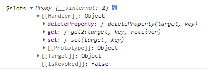
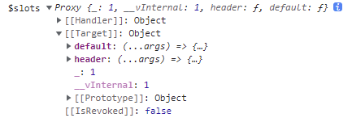
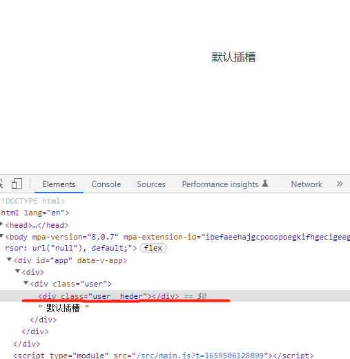
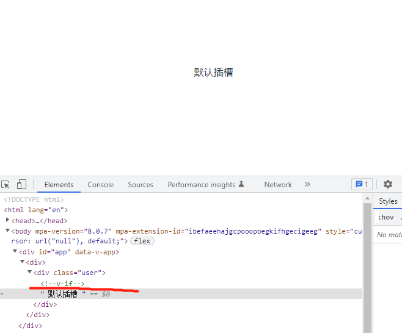

我们来看下有条件的渲染插槽。首先，我们来看个例子。

我们知道，每个 Vue 组件都 有一个特殊的对象 $slots，默认插槽的 key 是 default，其它命名插槽的 key，就是插槽的名称。

我们来看个例子，假设，有一个 User 组件，内容如下：

```html
// User.vue
<template>
  <div>
    <slot />
    <slot name="header"></slot>
  </div>
</template>

<script>
export default {
  mounted() {
    console.log("$slots", this.$slots);
  },
};
</script>
```

在 User 组件中，我们声明了两个插槽，一个是默认 `<slot />` ，还有一个命名插槽 header。然后，在组件挂载的时候把当前组件的 $slots 打印出来。

接着，在父组件中，我们引入一个 User 组件，内容如下：

```html
<template>
  <div>
    <User> </User>
  </div>
</template>

<script setup>
import User from "./components/User.vue";
</script>
```

运行时，可以在控制台看到如下内容：



我们发现在 User 组件打印的 $slots 对象是没有任何内容的，这是因为，我们在父组件中没有使用到 User 组件里面的插槽。

我们改造一下父组件，分别使用一下默认插槽和命名插槽，内容如下所示：

```html
<template>
  <div>
    <User>
      默认插槽
      <template #header>命名插槽</template>
    </User>
  </div>
</template>

<script setup>
import User from "./components/User.vue";
</script>
```

再次运行：



可以发现，这时候的 $slots 对象有两个属性，分别是 default 和 header。

从上可以发现：组件的$slots 对象有没有内容，在于我们在外面调用该组件时，有没有使用该组件的插槽功能。

好，利用这一特点，我们就可以有条件来渲染插槽了。例如：

```html
<template>
  <div class="user">
    <div class="user__heder">
      <slot name="header"></slot>
    </div>
    <slot />
  </div>
</template>
```

如上所示，假设我们想给命名插槽 header 默认一些自己特定的样式。但这样会有一个问题，如外面没有用到 header 插槽，那么在渲染 User 组件时，就会多渲染出来一个 `<div class="user__heder"> </div>`元素。如下所示：



多出来的这个 div 可能会影响到我们的布局，所以，我们需要判断当前是否有用到 header 插槽，如果没有，我们就需要隐藏它，怎么做呢？这就用到了，我们刚刚介绍的 $slots 对象：

```html
<template>
  <div class="user">
    <div v-if="$slots.header" class="user__heder">
      <slot name="header"></slot>
    </div>
    <slot />
  </div>
</template>
```

我们知道，只有用到 User 组件的 header 插槽时，$slots.header 才存在，所以我们就可以使用 v-if 来判断了。

运行：

