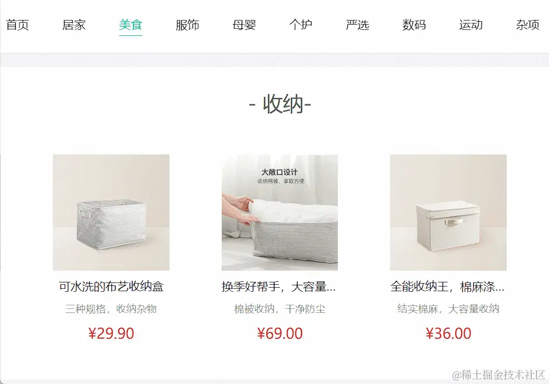
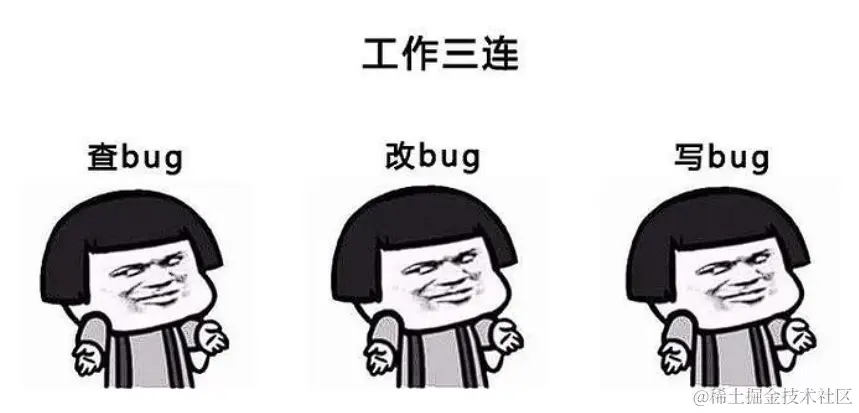

在 Vue.js 项目中，使用进行页面导航时，我们常常会有一个这样的场景,点击一级分类栏中的具体某个分类,之后,会发送请求获取该分类的数据并展示到页面中,

本质是将使用`<RouterLink to='' />`进行跳转,并传递了分类的参数，获取到数据展示。



但是我们在实现的时候可能会遇到页面不发生跳转的现象，常常困扰着入门小白


原因

Vue-Router 在渲染页面时，当遇到相同的组件时会复用该组件，这导致组件内部的数据不会再次初始化，生命周期函数也不会被再次触发。在涉及到路由传参时，就可能会引发不能请求数据的问题。


解决方案

为了解决这一问题，我们可以采用以下三种方法，确保在路由参数变化时，依然能够触发数据的重新请求。



1. 使用组件内路由守卫

通过在组件内部使用路由守卫，我们可以监听路由的变化并在变化发生时触发数据请求。 to 为所要跳转的路由对象，就可以获取跳转目标的 url 的参数。

```ts
// 使用钩子函数 onBeforeRouteUpdate
onBeforeRouteUpdate((to) => {
  getcategoryData(to.params.id); //这里的参数按照具体情况填写
});
```

onBeforeRouteUpdate 钩子: 这是 Vue 3 中的一个路由守卫，用于在当前路由更新时执行一些逻辑。它接受一个函数作为参数，这个函数会在路由发生变化时被调用。

(to) => { getcategoryData(to.params.id) } : 这是传递给 onBeforeRouteUpdate 的回调函数。这个回调函数接收一个参数 to，代表即将跳转的路由对象。通过 to.params.id，它获取了变化后的路由参数 id。

getcategoryData(to.params.id) : getcategoryData 是一个用于获取和处理数据的函数，它的参数是从路由中获取的 id 参数。这个函数会在路由变化时被触发，执行相应的数据请求逻辑。

2. 使用 Watch 监听路由参数变化

借助 Vue 的 Watch 功能，我们可以实时监听路由参数的变化，一旦变化就触发相应的数据请求。

```ts
watch(
  () => route.params.id, //这里的参数按照具体情况填写
  () => {
    getcategoryData();
  }
);
```

watch 函数: watch 是 Vue.js 提供的用于监听数据变化的函数。它接受两个参数，第一个参数是一个函数，返回需要被监听的数据，第二个参数是回调函数，当被监听的数据发生变化时执行。

() => route.params.id: 这是第一个参数，它使用箭头函数返回 route.params.id。在 Vue Router 中，route 对象表示当前路由状态，params 是其中的一个属性，表示路由的参数。这段代码监听了 id 参数的变化。

() => { getcategoryData() } : 这是第二个参数，是一个回调函数。当 route.params.id 发生变化时，就会执行这个回调函数，这个函数里通常会包含对数据的请求或处理逻辑。在这里，它调用了 getcategoryData() 函数。

3. 破坏组件复用

在路由出口标签中设置 key 属性，强制破坏组件复用，确保每次路由变化都能够重新渲染组件。

```ts
<RouterView :key="$route.fullPath" />
```

Vue Router: 这段代码涉及到 Vue.js 的路由系统，使用了<RouterView />组件。<RouterView /> 是 Vue Router 提供的用于渲染匹配到的路由组件的地方。

:key="$route.fullPath" : 这里使用了Vue.js中的属性绑定，使用 :key 来绑定一个值，该值是 $route.fullPath。$route 是 Vue Router 提供的一个表示当前路由状态的对象，fullPath 是其中的一个属性，表示当前完整的路由路径。

作用: 设置了 :key="$route.fullPath" 的作用是，每当路由发生变化时，$route.fullPath 的值也会变化，由于这个值被用作组件的 key，因此会导致组件被强制重新渲染。这样做的目的是为了确保在路由变化时，不复用之前的组件实例，而是创建一个新的组件实例，以确保组件能够重新加载和初始化。


