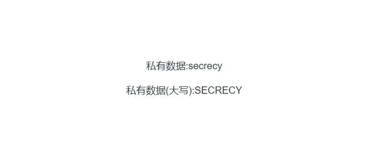
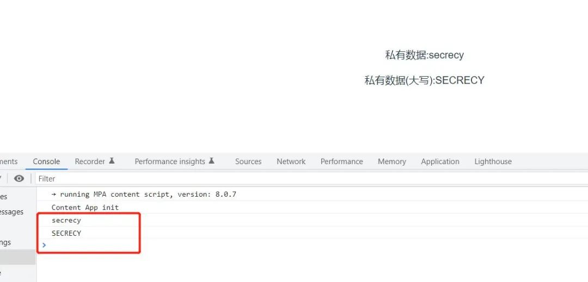
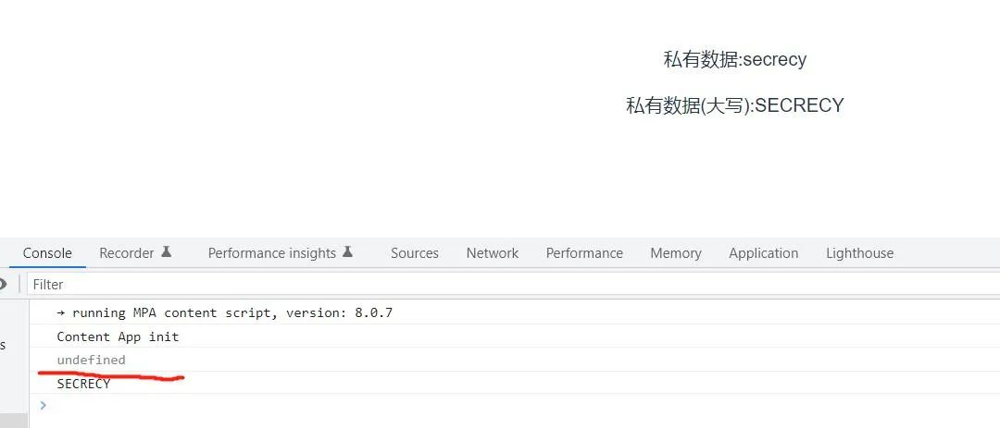

有时，当一个组件被 $ref 访问时，我们想指定该组件中的哪些属性可被访问，哪些不可访问。这里的不可访问，我们暂且先称作私有属性。那怎么来实现私有属性呢？

这个可以使用 vue3 中新出的 expose 属性，我们直接看例子。

```html
// User.vue
<template>
  <div>
    <p>私有数据:{{ privateData }}</p>
    <p>私有数据(大写):{{ upperCasePrivateData }}</p>
  </div>
</template>

<script>
export default {
  data() {
    return {
      privateData: 'secrecy',
    }
  },
  computed: {
    upperCasePrivateData() {
      return this.privateData.toUpperCase()
    },
  },
}
</script>
```

在 User 组件中，我们声明了一个  privateData 值为  secrecy，然后还有一个计算属性  upperCasePrivateData 它的值是 privateData  的大写形式。最后，在模板中把这两个值显示出来，如下所示：



接着，在父组件中，我们引入 User 并给它一个 ref 值，用来访问 User 组件中的内容，如下所示：

```html
<template>
  <User ref="useRef" />
</template>

<script setup>
import { ref, onMounted } from 'vue'
import User from './components/User.vue'

const useRef = ref(null)

onMounted(() => {
  console.log(useRef.value.privateData)
  console.log(useRef.value.upperCasePrivateData)
})
</script>
```

如上所示，我们声明了一个 useRef 表示对 User 组件的引用，然后在 onMounted 函数中也就是组件挂载完成时，把 useRef 的值打印出来，如下所示：



假设，这里我们不想让外界访问到 User 组件中的 privateData 值，那么，我们可以在 User 中使用 expose，它是一个数组，数组元素表示要暴露出来的属性。

比如，在 User 组件中，我们只想暴露 upperCasePrivateData 的值，那么就可以这么写：

```html
// User.vue
...
export default {
  expose: ['upperCasePrivateData'],
  ...
}
</script>
```

我们再次回到浏览，查看结果：



发现，此时 privateData 的值，我们已经获取不到了，它为 undefined。

这里的 expose 用法 ，我们使用的选项 API，那使用组合 API 要怎么写了，我们将 User组件改造成组合 API  的方式，如下所示：

```html
<script setup>
import { ref, computed } from 'vue'

const privateData = ref('secrecy')

const upperCasePrivateData = computed(() => {
  return privateData.value.toUpperCase()
})

defineExpose({
  upperCasePrivateData,
})
</script>
```

这里需要注意的是，如果使用`<script setup>` 方式，那么情况是与 选项API方式完全相同的，就是外面访问不到里面的内容，除非使用 defineExpose 暴露出去，这点是需要大家注意的。

另外：这里 defineExpose 是一个编译器宏，而不是一个实际的函数，所以我们不需要 导入任何东西

改造后，重新运行，效果还是一样的，如下所示：

