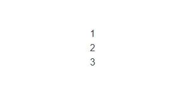
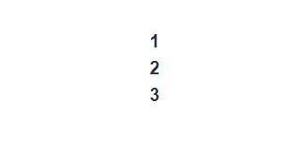

首先，我们先来看下什么是递归组组件，假设，我们有一个 VFor 组件，它的内容如下：

```html
// VFor.vue
<template>
  <div>
    {{ list[0] }}
    <v-for v-if="list.length > 1" :list="list.slice(1)" />
  </div>
</template>
<script>
export default {
  name: 'VFor',
  props: {
    list: Array,
  },
}
</script>
```

当 VFor 组件挂载时，我们渲染 list[0] 元素，接着，判断 list 长度是否大于 1，如果大于 1 ，则继续调用 vFor 自身组件，然后使用 list.slice(1)" 排除当前第 0 个元素，这样递归下去，直至  list.length > 1 不成立。


注意：大家可能对递归组件 不熟悉，一般用递归组件需要给个 name，也就是组件名称，然后在 模板中直接使用该 name 就是调用自身。

当然，也可以省略 name 属性，不过你文件名要跟内部使用的 组件名称一样。

在父组件中调用 VFor 组件，如下所示：

```html
<template>
  <div>
    <VFor :list="list" />
  </div>
</template>

<script setup>
import { ref } from 'vue'
import VFor from './components/VFor.vue'

const list = ref([1, 2, 3])
</script>
```

运行效果如下：



了解了递归组件后，我们来看看递归插槽。

上个例子中，我们直接在 VFor 组件把 list[0] 显示出来。此时，当我们在外面调用该组件时，想对 list 内容进行一些样式上的包装，那我们现在这种写法是满足不了。因为，在外面用户拿不到当前 list[0] 的内容，没也没对应的坑位。

所以，这里我们需要提供一个默认插槽的功能，但同时又想把当前的 list[0] 的值暴露出去，这时候我们就可以用到作用域插槽功能了。我们把  VFor 组件调整一下，内容如下：

```html
<!-- VFor.vue -->
<template>
  <div>
    <slot v-bind:item="list[0]">
      {{ list[0] }}
    </slot>
    <v-for v-if="list.length > 1" :list="list.slice(1)">
      <template v-slot="{ item }">
        <slot v-bind:item="item"></slot>
      </template>
    </v-for>
  </div>
</template>

<script>
export default {
  name: 'VFor',
  props: {
    list: Array,
  },
}
</script>
```

这里，我们用到了作用域插槽，为了让  list[0] 在父级 插槽内容可用，我们可以将 list[0] 作为 <slot> 元素 attribute 绑定上去。

绑定在 <slot> 元素上的 attribute 被称为插槽 prop。现在在父级作用域中，我们可以使用带值的 v-slot 来定义我们提供的插槽 prop 的名字。

但在我们的  VFor 组件，因为我们是递归调用自己的，所以我们使用带值的 v-slot 来获取 item 的内容，也就出现如下的方式：

```html
<v-for v-if="list.length > 1" :list="list.slice(1)">
      <template v-slot="{ item }">
        <slot v-bind:item="item"></slot>
      </template>
</v-for>
```

定义好了作用域插槽后，我们在父组件中使用一下，可以使用正常模式和插槽模式，正常模式就是我们上面的例子，我们来看插槽的方式：

```html
<template>
  <div>
    <VFor :list="list">
      <template v-slot="{ item }">
        <strong>{{ item }}</strong>
      </template>
    </VFor>
  </div>
</template>

<script setup>
import { ref } from 'vue'
import VFor from './components/VFor.vue'

const list = ref([1, 2, 3])
</script>
```

这里，我们通过作用域插槽拿到了 item 内容，然后我们用 srong 标签把它显示出来，这样就达到了我们想要自定义内容的效果。

运行：

